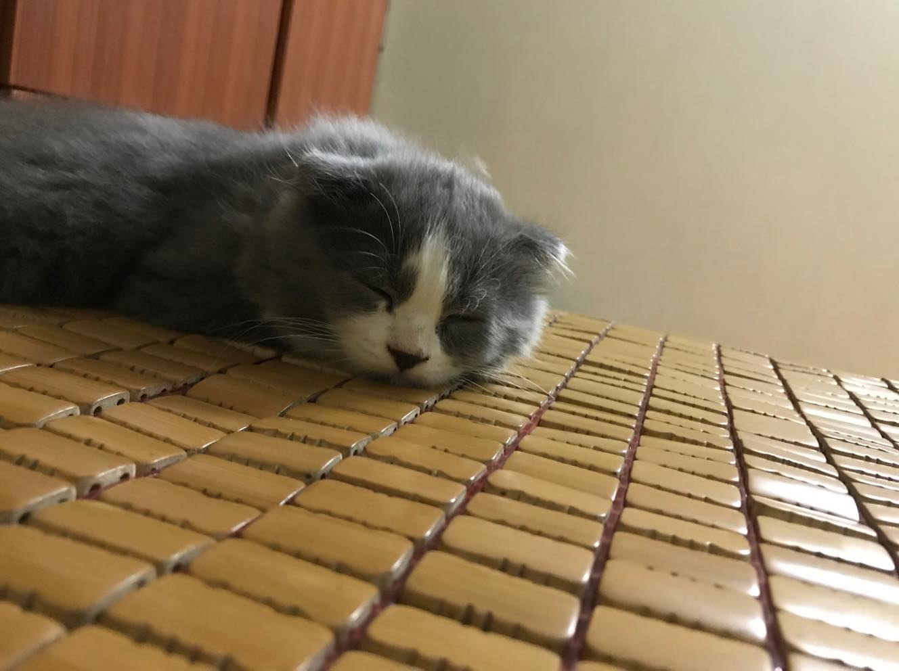
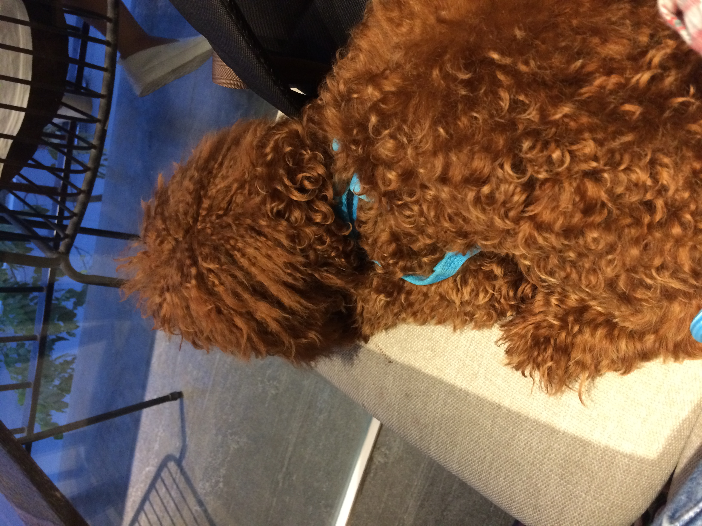

# Hacktoberfest cutiest pet 🙊

## Why you need to join this project?
- You like Hacktoberfest and you want a shirt (if you don't know what Hacktoberfest is, just come [here](https://hacktoberfest.digitalocean.com))
- You have pet and want to share his/her cute to another
- You have no pet and just want to see someone's pet (there is a vote section for the cutiest pet which you can contribute to)
- You only have computer but no shirt!!

## How to contribute?
1. Fork this repo into your Github profile

2. Post your pet's image(🐶🐱 🦝🦁🐒🦆🐢🐍🐳🐆🦍):

2.1. Upload your pet's image in root directory with the following naming convention:
- If you have only 1 image: `<your_pet_name>-<your_name>.<jpg|jpeg|png|...>`, eg: `bi-minh_nguyen.png` (bi is my pet's name, minh_nguyen is my name)
- If you have another image: `<your_pet_name>-<your_name>_<ordinal_number>.<jpg|jpeg|png|...>`, eg: `bi-minh_nguyen_1.png`, `bi-minh_nguyen_2.png` 

2.2. Write your pet's name and insert his/her image in `Vote for cutiest pet` section in `README.md`

3. Vote for cutiest pet: Sign your name below pet you love in `Vote for cutiest pet` section in `README.md` (you can vote more than 1 pet)

## How to make pull requests?
Please make pull requests with below naming convention
- Title: `<post|vote>-<your_pet_name(if you post pet's image)>-<your_name>`
- Lable: `hacktoberfest`

### Thanks and have fun 🐣

## Vote for cutiest pet
- Bi - Minh Nguyen

Minh Nguyen

- Bom - Tu Tran

Tu Tran

